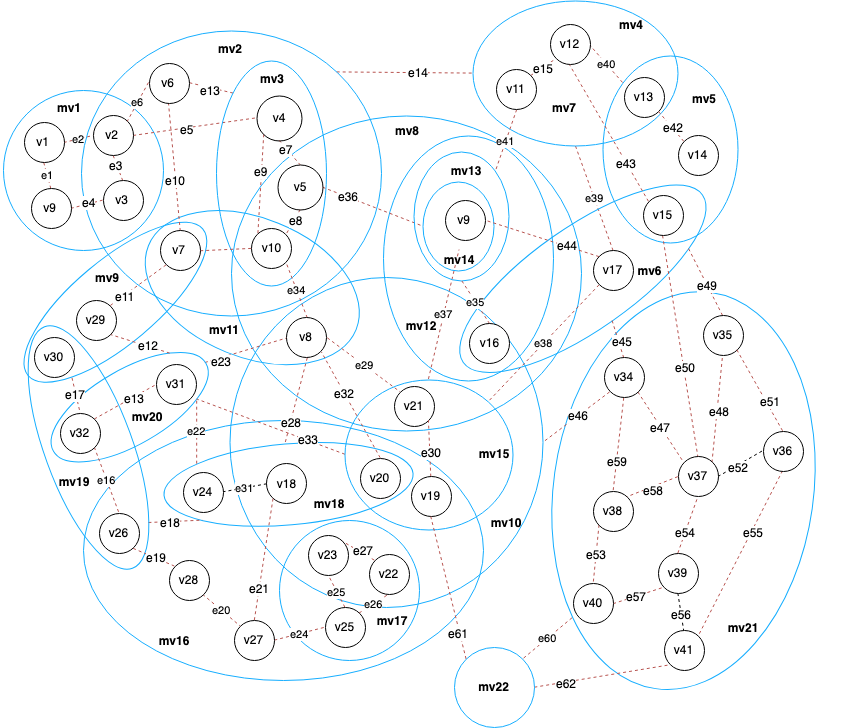
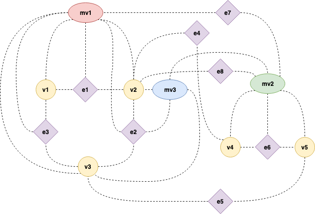
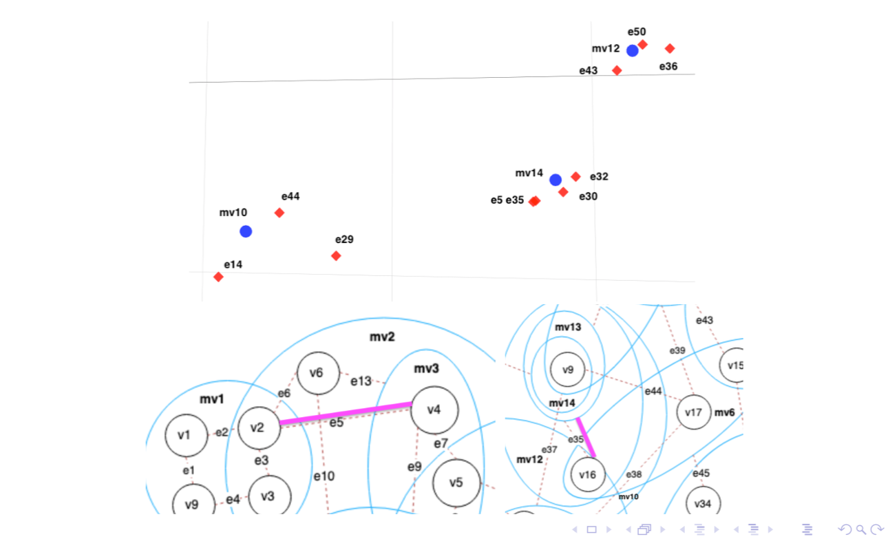
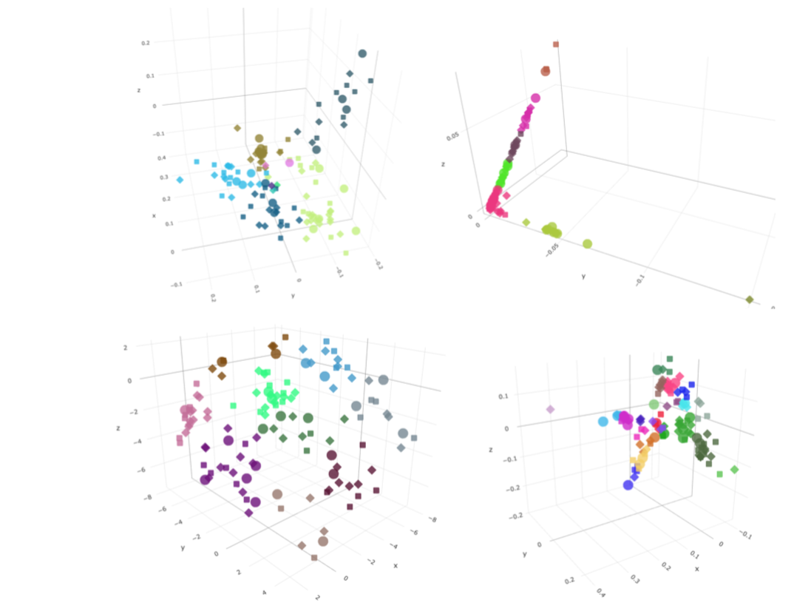
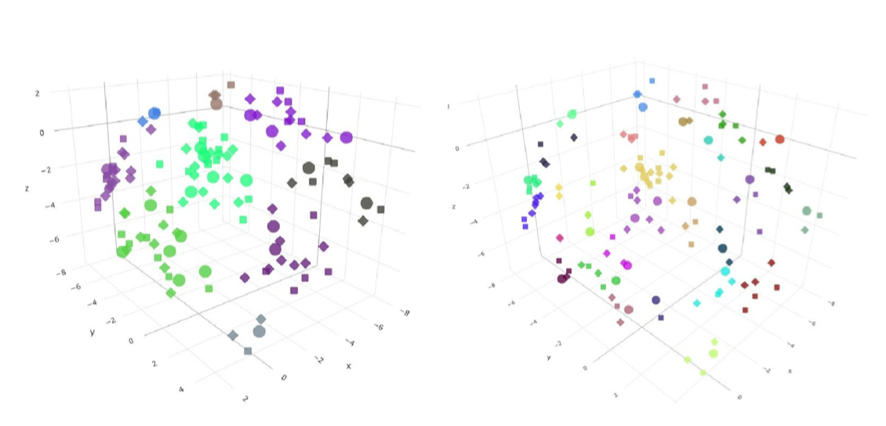
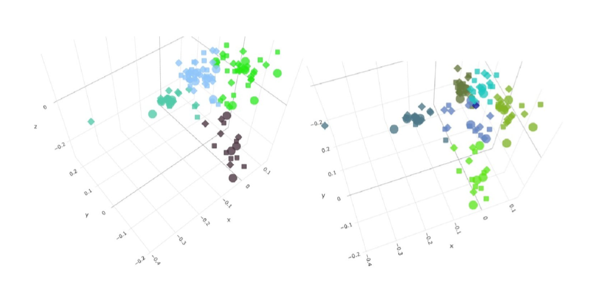
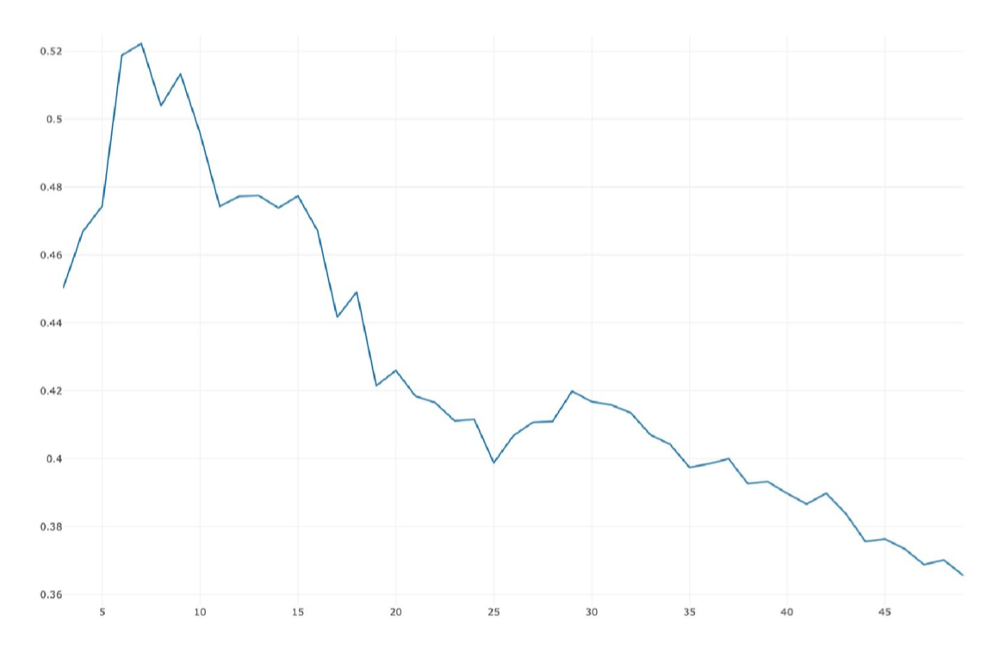

# Metagraph Embedding
Metagraph -> 3-partite graph -> vector representations -> clustering -> Silhouette_score(k)

## Metagraph

## Proxy-graph

## Vector representations

Graph embedding methods:
1. Graph Laplacial Eigenmaps
2. Node Proximity Matrix Factorization
3. Node2Vec

## Vector clustering

Clustering methods:
1. K-means
2. Spectral clustering
3. Agglomerative clustering

Clustering metrics:
1. Silhouette_score(k), k - cluster quantity

